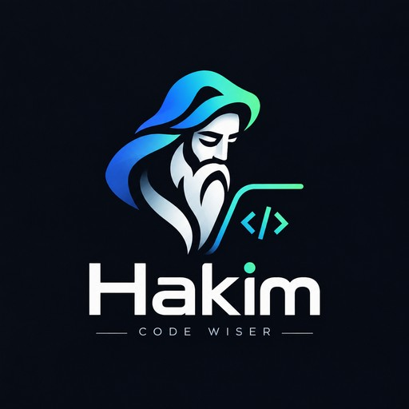

<div align="center">



<h1>Hakim (حَكِيم)</h1>

<p><strong>A judgment layer for AI coding agents.</strong></p>

<p>Smaller changes. Safer actions. Claims backed by evidence.</p>

<p><strong><kbd>Public beta</kbd> · <kbd>v1.0.0-beta.11</kbd> · <kbd>MIT</kbd> · <kbd>Codex</kbd> · <kbd>Claude Code</kbd> · <kbd>GitHub Copilot CLI</kbd> · <kbd>OpenCode</kbd></strong></p>

</div>

---

Hakim gives capable coding agents a compact engineering decision model before they start adding code, dependencies, abstractions, or confident completion claims.

It does **not** turn your agent into a workflow bot. The host still owns permissions, tools, sandboxing, trust prompts, and execution. Hakim focuses on one narrower problem: **better judgment about what should change, how much evidence is enough, and what the result actually proves.**

## Why Hakim exists

AI coding agents are increasingly good at implementation. They can still make expensive judgment mistakes:

- adding a dependency when the platform already solves the problem;
- creating an abstraction before there is a real need for one;
- inspecting far more of the repository than the task requires;
- weakening a security, migration, rollback, or compatibility guard to make a change look simpler;
- declaring success from a green command that did not actually prove the user-visible result.

Hakim gives the agent a small decision ladder:

```text
need?
  → reuse?
  → stdlib?
  → native platform?
  → accepted dependency?
  → smaller clear implementation?
  → minimum custom code
```

The goal is not the fewest lines. It is the **smallest sufficient safe change**.

## What changes in practice

Without an explicit judgment layer, an agent may jump from a request directly to implementation.

With Hakim active, the agent is guided to answer a few higher-value questions first:

```text
Do we need a change at all?
Can the repository or platform already do this?
What real guard must remain true?
What is the smallest coherent implementation?
What verification actually supports the completion claim?
```

Hakim then gets out of the way. It does not prescribe a universal command sequence or force every task through the same ceremony.

## Who it is for

| If you are… | Hakim is useful when… |
|---|---|
| **An experienced developer** | You want AI agents to preserve engineering constraints, reuse existing architecture, avoid speculative machinery, and keep claims proportional to evidence without replacing your judgment or your host's native controls. |
| **An ambitious AI / vibe coder** | You can build quickly with coding agents but want a stronger safety net against unnecessary complexity, accidental repository changes, weak verification, and confident answers that outrun what was actually checked. |

You do not need to memorize Hakim's full model. The default `full` mode is designed to be the normal starting point.

---

<h2 align="center">Quick install</h2>

<p align="center">Install from an immutable reviewed release tag:</p>

```bash
export HAKIM_REF=v1.0.0-beta.11
```

### Codex

```bash
codex plugin marketplace add https://github.com/Habib1001-m/hakim.git --ref "$HAKIM_REF"
```

Open `/plugins`, install **Hakim**, then start a new thread.

### Claude Code

```bash
claude plugin marketplace add "https://github.com/Habib1001-m/hakim.git#$HAKIM_REF"
claude plugin install hakim@hakim
```

Start a fresh Claude session after installation.

### GitHub Copilot CLI

```bash
copilot plugin marketplace add "Habib1001-m/hakim#$HAKIM_REF"
copilot plugin install hakim@hakim
```

### OpenCode

Run from the repository where you want Hakim available:

```bash
npx --yes --package="github:Habib1001-m/hakim#$HAKIM_REF" hakim-opencode install
```

OpenCode support is project-local, preserves unrelated `.opencode` content, refuses unsafe conflicting managed state, and does not edit `opencode.json`.

For host-specific lifecycle, verification, and removal instructions, see **[Install Hakim](core/hakim-skill/INSTALL.md)**.

## Start with `full`

Hakim has four modes, all controlled through the single `hakim` capability:

| Mode | Use it when |
|---|---|
| `full` | **Default.** You want the complete judgment model with proportional verification. |
| `lite` | You want normal execution with a lighter nudge toward a materially smaller safe alternative when one exists. |
| `ultra` | You want the agent to challenge additions, abstractions, and dependencies aggressively while preserving the required outcome and real guards. |
| `off` | You want Hakim guidance disabled for the session beyond host, repository, and safety boundaries. |

Use Hakim's installed `help` capability for the exact invocation syntax on your current host.

## Six capabilities, one product model

| Capability | What it is for |
|---|---|
| `hakim` | Core execution judgment and mode control. |
| `review` | Read-only review of an explicit scope for removable complexity. |
| `audit` | Deeper evidence-backed repository inspection when broader evidence is actually needed. |
| `debt` | Current deliberate shortcuts and technical-debt provenance. |
| `status` | What the current evidence establishes — no stronger. |
| `help` | Current-host usage, modes, capabilities, and trust boundaries. |

All four maintained hosts expose the same **semantic** capability model. Their commands, hooks, agents, permissions, caches, and lifecycle differ because Hakim uses each host's native extension model instead of adding a lowest-common-denominator runtime.

---

## What Hakim deliberately does not do

Hakim does not add a daemon, MCP server, LSP, A2A layer, or cross-host workflow engine merely to make the integrations look identical.

It does not replace:

- your coding agent;
- repository instructions and protections;
- the host's permissions, sandbox, approvals, or managed policy;
- real security review or domain expertise;
- evidence with confidence-sounding prose.

Hakim also does not claim universal improvements in model quality, speed, token use, cost, security, adoption, or ROI. A passing test proves the scope that test checked.

## Trust and release model

Hakim is public beta software. Supported installs use immutable release tags rather than moving branch state.

The repository includes deterministic release packaging, a CycloneDX SBOM generator, SHA-256 checksum generation, and release-manifest verification. These improve inspectability; they are not code signing, notarization, an external provenance attestation, or proof that the software is vulnerability-free.

Hakim does not implement a product telemetry collection service and does not enable raw prompt or source-code logging as a product feature.

Read the boundaries before using Hakim in a sensitive environment:

- **[Security](SECURITY.md)**
- **[Known limitations](docs/KNOWN_LIMITATIONS.md)**
- **[Supported hosts](docs/SUPPORTED_HOSTS.md)**

## How it is built

Hakim has one canonical judgment model and four host-native projections:

```text
                canonical Hakim core
                       │
          ┌────────────┼────────────┬────────────┐
          │            │            │            │
        Codex       Claude       Copilot      OpenCode
```

The shared product is intentionally small; host-specific code exists only where the host requires native integration behavior.

For the technical design, see **[Architecture](docs/ARCHITECTURE.md)**.

---

## Documentation

Start at **[Hakim documentation](docs/README.md)**, or go directly to:

- [Install and lifecycle](core/hakim-skill/INSTALL.md)
- [Supported hosts](docs/SUPPORTED_HOSTS.md)
- [Architecture](docs/ARCHITECTURE.md)
- [Known limitations](docs/KNOWN_LIMITATIONS.md)
- [Security](SECURITY.md)
- [Support](docs/SUPPORT.md)
- [Versioning](docs/VERSIONING.md)
- [Changelog](CHANGELOG.md)

## Development

Repository development requires Node.js 22+ and Python 3.10+.

```bash
git clone https://github.com/Habib1001-m/hakim.git
cd hakim
npm test
```

`npm test` checks maintained product/runtime contracts and release packaging. See **[Contributing](CONTRIBUTING.md)** before proposing a change.

Hakim is inspired by Ponytail. Attribution and applicable third-party notices are in **[Third-Party Notices](THIRD_PARTY_NOTICES.md)**.
